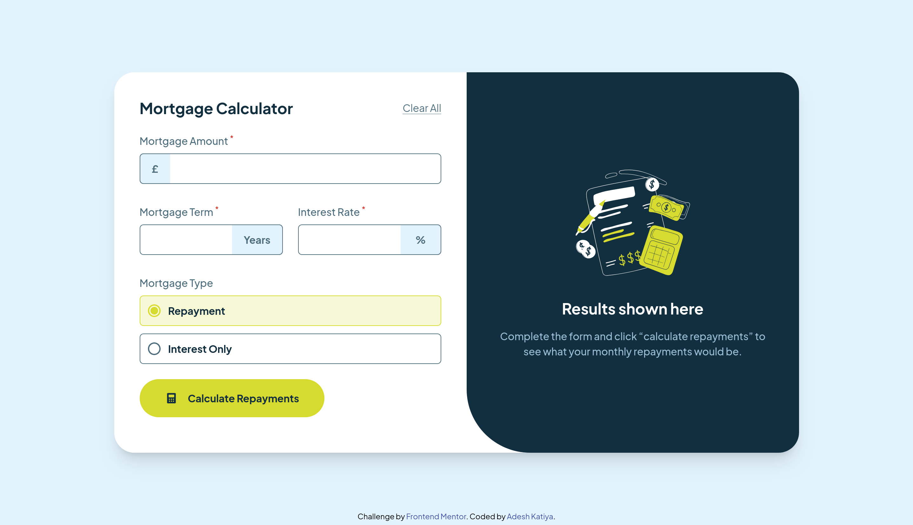

# Frontend Mentor - Mortgage repayment calculator solution

This is a solution to the [Mortgage repayment calculator challenge on Frontend Mentor](https://www.frontendmentor.io/challenges/mortgage-repayment-calculator-Galx1LXK73). Frontend Mentor challenges help you improve your coding skills by building realistic projects.

## Table of contents

- [Frontend Mentor - Mortgage repayment calculator solution](#frontend-mentor---mortgage-repayment-calculator-solution)
  - [Table of contents](#table-of-contents)
  - [Overview](#overview)
    - [The challenge](#the-challenge)
    - [Screenshot](#screenshot)
    - [Links](#links)
  - [My process](#my-process)
    - [Built with](#built-with)
    - [What I learned](#what-i-learned)
    - [Continued development](#continued-development)

## Overview

### The challenge

Users should be able to:

- Input mortgage information and see monthly repayment and total repayment amounts after submitting the form
- See form validation messages if any field is incomplete
- Complete the form only using their keyboard
- View the optimal layout for the interface depending on their device's screen size
- See hover and focus states for all interactive elements on the page

### Screenshot

### Links

- Solution URL: [Mortgage Repayment Calculator](https://www.frontendmentor.io/solutions/responsive-mortgage-payment-calculator-using-react-tailwind-and-vite-WnWVy-28sj)
- Live Site URL: [Mortgage Repayment Calculator](https://fem-mortgage-repayment-calculator-five.vercel.app/)

## My process

### Built with

- Semantic HTML5 markup
- CSS custom properties
- Flexbox
- Mobile-first workflow
- [React](https://reactjs.org/) - JS library
- [Tailwind CSS](https://tailwindcss.com) - For styles
- [Vite](https://vite.dev/) - Build tool

### What I learned

- Learned about state management and globally managing multiple states.
- Learned about inputting form data and update form's state and also validate the data entered by the user.
- Learned about conditional rendering.

### Continued development

- using React Hook Form for form handling.
